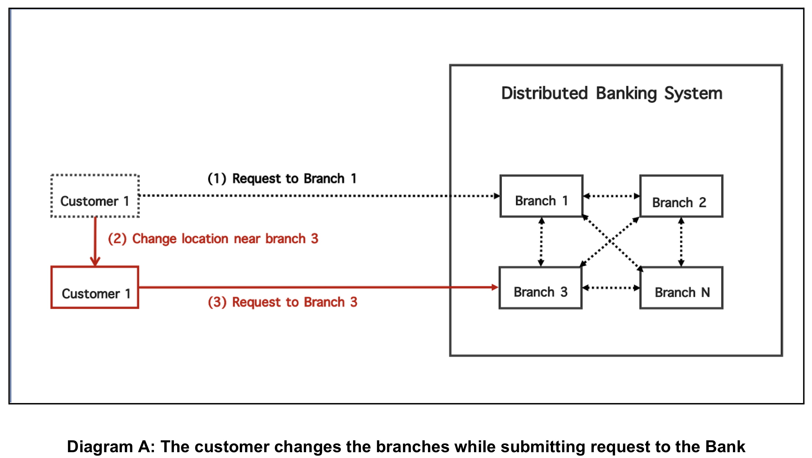

# Client-Centric Consistency Implementation on a gRPC-based Distributed Banking Simulator
<br>

In this project we simulate a distributed banking system that allows a single customer to be able to withdraw or deposit money from multiple branches in the bank. The main goal is to implement a client-centric consistency model across the system. Client-centric consistency provides guarantees for a single client concerning the consistency of accesses to a data store by that client. In this simulation, the branches are connected to each other and are expected to propagate (via gRPC channels) all **deposit** and **withdraw** transactions from the customers.

<br>

With this model, the customer is be able to execute different write operations across different branches which should then be able to propagate and mantain the correct order of operations. In order to accomplish this, the system enforces consistency by implementing [Monotonic Writes](https://en.wikipedia.org/wiki/Consistency_model#Monotonic_write_consistency) and [Read your Writes](https://en.wikipedia.org/wiki/Consistency_model#Read-your-writes_consistency).

<br>




<br>

gRPC server and client code have been generated utilizing the protocol buffer compiler and the **banking.proto** file


```
python -m grpc_tools.protoc -I. --python_out=. --grpc_python_out=. banking.proto
```

<br>


To test run the system, `cd` into the repository directory and run the following command:<br> `python -m main`
<br><br>
#### **Example output** (test_input_output.py file):

_Note: this project is a fork of my previous project [gRPCDistributedBankingSimulator](https://github.com/navarro165/gRPCDistributedBankingSimulator) 
so the sample output here will focus mostly on demonstrating Client-Centric Consistency_.

```
DistributedDataStoreClientCentricConsistency git:(master) ✗ python -m main        

Starting test 1...

Collecting input data...

Branch Processes: [
    {
        "id": 1,
        "type": "branch",
        "balance": 0
    },
    {
        "id": 2,
        "type": "branch",
        "balance": 0
    }
]

Customer Processes: [
    {
        "id": 1,
        "type": "customer",
        "events": [
            {
                "interface": "deposit",
                "money": 400,
                "id": 1,
                "dest": 1
            },
            {
                "interface": "withdraw",
                "money": 400,
                "id": 2,
                "dest": 2
            },
            {
                "interface": "query",
                "id": 3,
                "dest": 2
            }
        ]
    }
]

Starting branch processes...
        - server started, listening on 50051
        - server started, listening on 50052

Branch balances (initial balance):
        - id: 1, balance: 0
        - id: 2, balance: 0

... STARTING CUSTOMER EVENTS ...
        > branch 1 received deposit from customer 1 for the amount of: $ 400.0
        > branch 1 adding to writeset event 1
        ** propagating branch 1 deposit of $400.0 to branches [2]:
        > branch 2 received deposit from branch 1 for the amount of: $ 400.0
        > branch 2 adding to writeset event 1
        > branch 2 balance is $400.0
        ******************************************************************
                Validating that all writes have propagated to all branches:
                > Propagation successful!
        ******************************************************************
        > branch 2 received withdraw from customer 1 for the amount of: $ 400.0
        > branch 2 adding to writeset event 2
        ** propagating branch 2 withdraw of $400.0 to branches [1]:
        > branch 1 received withdraw from branch 2 for the amount of: $ 400.0
        > branch 1 adding to writeset event 2
        > branch 1 balance is $0.0
        ******************************************************************
                Validating that all writes have propagated to all branches:
                > Propagation successful!
        ******************************************************************
        > branch 2 received query from customer 1
        > branch 2 balance is $0.0

Finished executing customer events:
> Successfully executed write events in the correct order

Waiting 3 sec before wrapping up...

Branch balances (final balance):
        - id: 1, balance: 0.0
        - id: 2, balance: 0.0

SANITY CHECK:
Write sets per branch organized by customer id:
> ie: {branch_id: {customer_id: [write_event_1, ...]}}
[
    {
        "branch_1": {
            "1": [
                1,
                2
            ]
        }
    },
    {
        "branch_2": {
            "1": [
                1,
                2
            ]
        }
    }
]

SANITY CHECK:
All events per branch organized by customer id:
> ie: {branch_id: {customer_id: [event_1, ...]}}
[
    {
        "branch_1": {
            "1": {
                "1": {
                    "interface": "deposit",
                    "money": 400.0,
                    "event_id": 1
                },
                "2": {
                    "interface": "withdraw",
                    "money": 400.0,
                    "event_id": 2
                }
            }
        }
    },
    {
        "branch_2": {
            "1": {
                "1": {
                    "interface": "deposit",
                    "money": 400.0,
                    "event_id": 1
                },
                "2": {
                    "interface": "withdraw",
                    "money": 400.0,
                    "event_id": 2
                },
                "3": {
                    "interface": "query",
                    "money": 0.0,
                    "event_id": 3
                }
            }
        }
    }
]

Output:
[
    {
        "id": 1,
        "balance": 0.0
    }
]


Starting test 2...

Collecting input data...

Branch Processes: [
    {
        "id": 1,
        "type": "branch",
        "balance": 0
    },
    {
        "id": 2,
        "type": "branch",
        "balance": 0
    }
]

Customer Processes: [
    {
        "id": 1,
        "type": "customer",
        "events": [
            {
                "interface": "deposit",
                "money": 400,
                "id": 1,
                "dest": 1
            },
            {
                "interface": "query",
                "id": 2,
                "dest": 2
            }
        ]
    }
]

Starting branch processes...
        - server started, listening on 50051
        - server started, listening on 50052

Branch balances (initial balance):
        - id: 1, balance: 0
        - id: 2, balance: 0

... STARTING CUSTOMER EVENTS ...
        > branch 1 received deposit from customer 1 for the amount of: $ 400.0
        > branch 1 adding to writeset event 1
        ** propagating branch 1 deposit of $400.0 to branches [2]:
        > branch 2 received deposit from branch 1 for the amount of: $ 400.0
        > branch 2 adding to writeset event 1
        > branch 2 balance is $400.0
        ******************************************************************
                Validating that all writes have propagated to all branches:
                > Propagation successful!
        ******************************************************************
        > branch 2 received query from customer 1
        > branch 2 balance is $400.0

Finished executing customer events:
> Successfully executed write events in the correct order

Waiting 3 sec before wrapping up...

Branch balances (final balance):
        - id: 1, balance: 400.0
        - id: 2, balance: 400.0

SANITY CHECK:
Write sets per branch organized by customer id:
> ie: {branch_id: {customer_id: [write_event_1, ...]}}
[
    {
        "branch_1": {
            "1": [
                1
            ]
        }
    },
    {
        "branch_2": {
            "1": [
                1
            ]
        }
    }
]

SANITY CHECK:
All events per branch organized by customer id:
> ie: {branch_id: {customer_id: [event_1, ...]}}
[
    {
        "branch_1": {
            "1": {
                "1": {
                    "interface": "deposit",
                    "money": 400.0,
                    "event_id": 1
                }
            }
        }
    },
    {
        "branch_2": {
            "1": {
                "1": {
                    "interface": "deposit",
                    "money": 400.0,
                    "event_id": 1
                },
                "2": {
                    "interface": "query",
                    "money": 0.0,
                    "event_id": 2
                }
            }
        }
    }
]

Output:
[
    {
        "id": 1,
        "balance": 400.0
    }
]
```